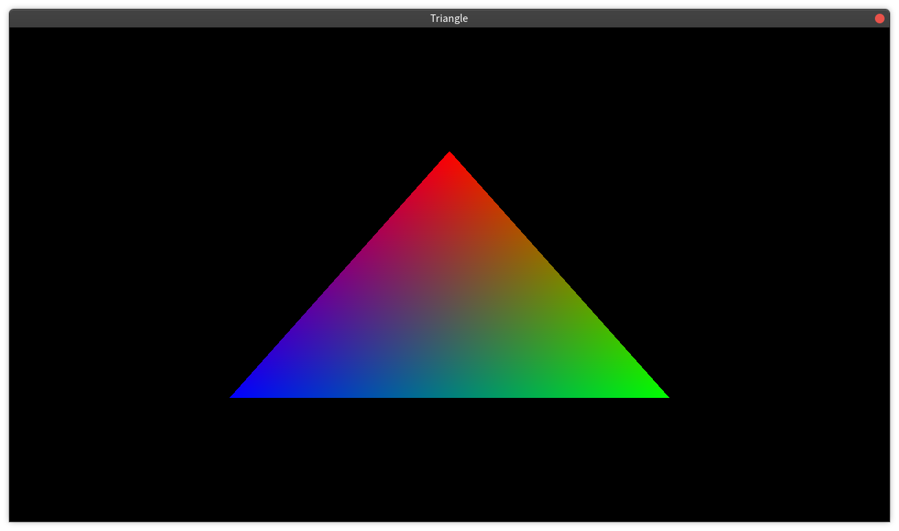
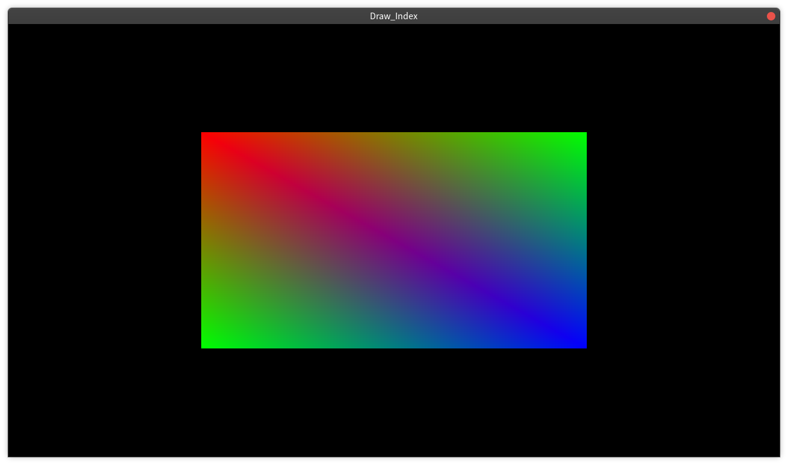
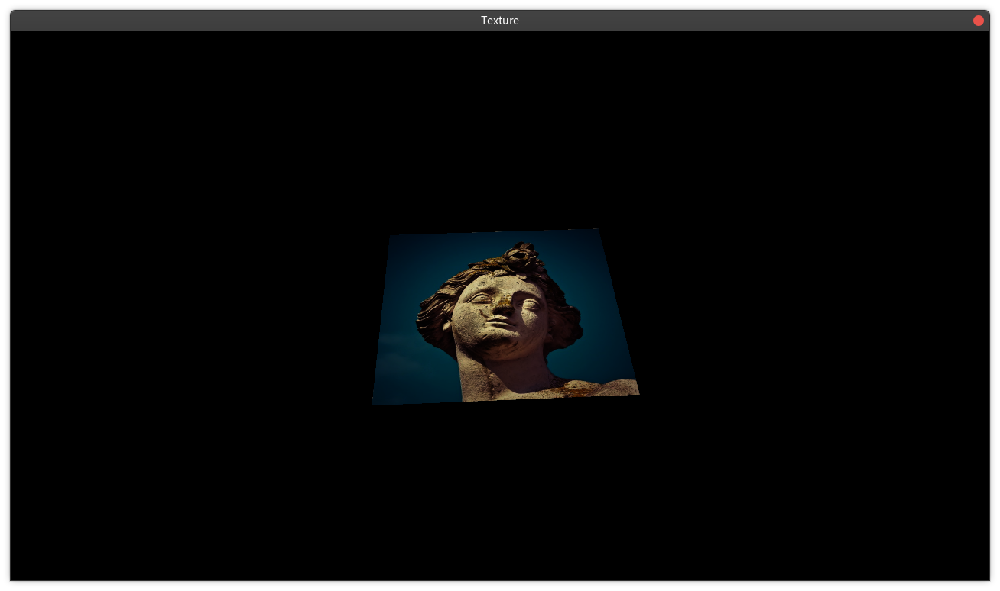

# Examples

## Hello Triangle
Draw a colorful triangle using components of VulkanContext.
1. Vertex

2. StageBuffer



## Draw with Index
Upgraded version of Hello Triangle. Just changed several lines.
Note that: 

1. Draw the triangles clockwise or conter-clockwise only, it depends on how you created the pipeline.
Triangles with wrong directions of indices will not be presented.
```C++
VkPipelineRasterizationStateCreateInfo rasterizer{};
...
rasterizer.cullMode = VK_CULL_MODE_BACK_BIT;
rasterizer.frontFace = VK_FRONT_FACE_CLOCKWISE;
```



## Uniform Buffer

Control model direction, camera position, view direction, upward direction and projection through uniform buffer. 


## Texture

Bind texture to a rectangle. 



## MipMap

## Mesh